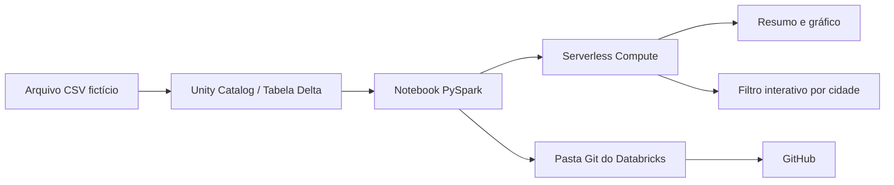
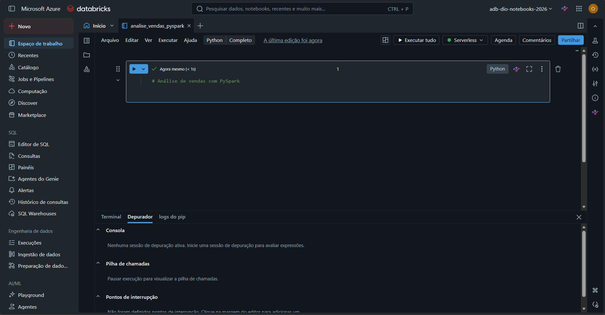
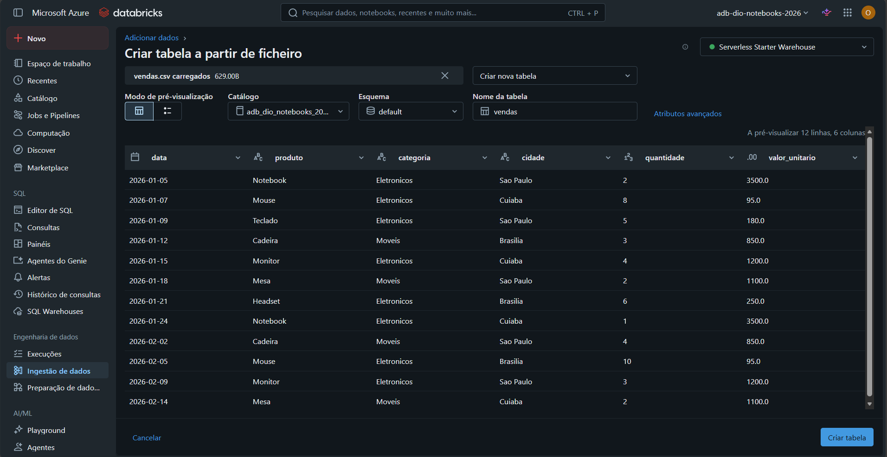
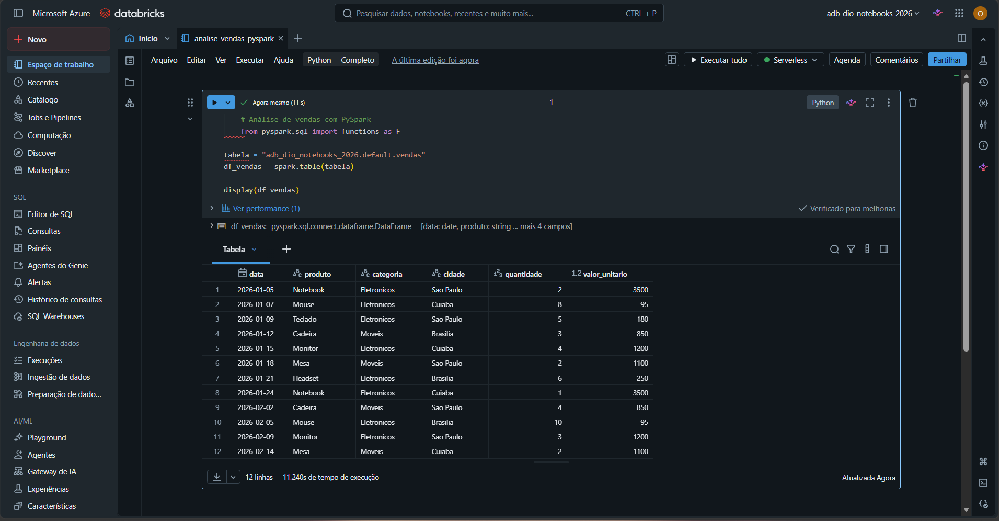
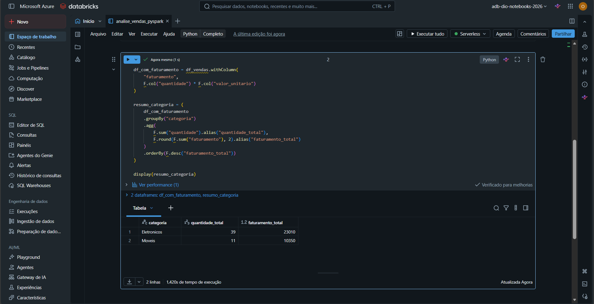
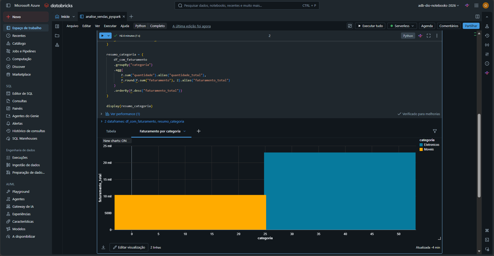
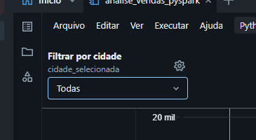
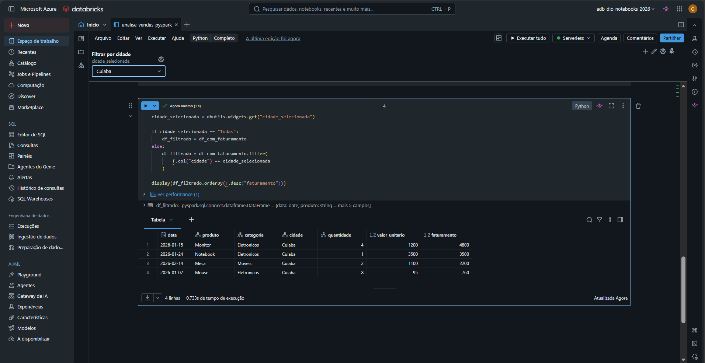
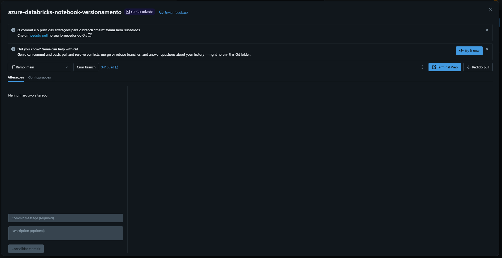

# Controle e Versionamento de Código no Azure Databricks

Projeto prático desenvolvido para demonstrar a organização, análise e o versionamento de notebooks no Azure Databricks, utilizando PySpark, Unity Catalog, Serverless Compute e integração com GitHub.

## Objetivo

Criar um notebook interativo para análise de vendas fictícias, aplicando transformações com PySpark, sumarização de dados, visualização gráfica e filtro por cidade. Ao final, versionar o notebook em um repositório GitHub usando uma Pasta Git do Azure Databricks.

## Arquitetura



## Tecnologias utilizadas

- Microsoft Azure
- Azure Databricks
- Apache Spark e PySpark
- Unity Catalog
- Serverless Compute
- Delta Lake
- GitHub
- Git Folders do Databricks

## Etapas realizadas

### 1. Criação do ambiente

Foi criado um workspace Azure Databricks para centralizar o desenvolvimento do notebook e o gerenciamento dos dados.



> O compute Serverless foi utilizado para executar o laboratório sem depender de máquinas virtuais provisionadas manualmente.

### 2. Importação e criação da tabela

Foi criado um arquivo CSV fictício com vendas por data, produto, categoria e cidade. Em seguida, os dados foram importados para uma tabela Delta no Unity Catalog.

Tabela utilizada:

```text
adb_dio_notebooks_2026.default.vendas
```



### 3. Leitura dos dados com PySpark

O notebook realiza a leitura da tabela usando Spark e exibe os registros para validação.

```python
from pyspark.sql import functions as F

tabela = "adb_dio_notebooks_2026.default.vendas"
df_vendas = spark.table(tabela)

display(df_vendas)
```



### 4. Transformação e sumarização

Foi criada a coluna `faturamento`, calculada pela multiplicação entre quantidade e valor unitário. Depois, os dados foram agrupados por categoria.

```python
df_com_faturamento = df_vendas.withColumn(
    "faturamento",
    F.col("quantidade") * F.col("valor_unitario")
)

resumo_categoria = (
    df_com_faturamento
    .groupBy("categoria")
    .agg(
        F.sum("quantidade").alias("quantidade_total"),
        F.round(F.sum("faturamento"), 2).alias("faturamento_total")
    )
    .orderBy(F.desc("faturamento_total"))
)

display(resumo_categoria)
```



### 5. Visualização dos resultados

A sumarização foi transformada em um gráfico de barras para facilitar a comparação do faturamento entre as categorias.



### 6. Filtro interativo no notebook

Foi criado um widget para permitir a seleção de uma cidade e tornar o notebook interativo.

```python
dbutils.widgets.dropdown(
    "cidade_selecionada",
    "Todas",
    ["Todas", "Sao Paulo", "Cuiaba", "Brasilia"],
    "Filtrar por cidade"
)
```





### 7. Versionamento com GitHub

O notebook foi movido para uma Pasta Git do Databricks e enviado ao repositório GitHub por meio de commit e push na branch `main`.

```text
feat: adiciona notebook PySpark de análise de vendas
```



## Estrutura do repositório

```text
azure-databricks-notebook-versionamento/
├── evidencias/
│   └── imagens do desenvolvimento
├── notebooks/
│   └── analise_vendas_pyspark.ipynb
└── README.md
```

## Resultados observados

| Categoria | Quantidade total | Faturamento total |
| --- | ---: | ---: |
| Eletronicos | 39 | 23.010 |
| Moveis | 11 | 10.350 |

## Insights obtidos

- O Unity Catalog facilita a organização e o acesso governado aos dados.
- O PySpark permite transformar e sumarizar dados de forma escalável.
- Widgets tornam notebooks mais interativos e reutilizáveis.
- Visualizações ajudam a comunicar resultados técnicos para públicos não técnicos.
- O uso de Pastas Git integra o desenvolvimento de notebooks ao controle de versão.
- A lógica do notebook foi estruturada com apoio de IA e validada pela execução no Databricks.
- Embora este projeto use GitHub, o mesmo fluxo de versionamento pode ser aplicado com Azure DevOps em ambientes corporativos.

## Possíveis evoluções

- Parametrizar o nome do catálogo, esquema e tabela.
- Armazenar arquivos de origem no Azure Data Lake Storage.
- Criar testes de qualidade para os dados.
- Executar o notebook de forma agendada com Jobs.
- Criar uma esteira de CI/CD com GitHub Actions ou Azure DevOps.
- Publicar os resultados em um dashboard.

## Autor

Antony Kennedy Ribeiro de Araújo

Projeto desenvolvido como parte do bootcamp Microsoft AI for Tech - Azure Databricks da plataforma DIO.
